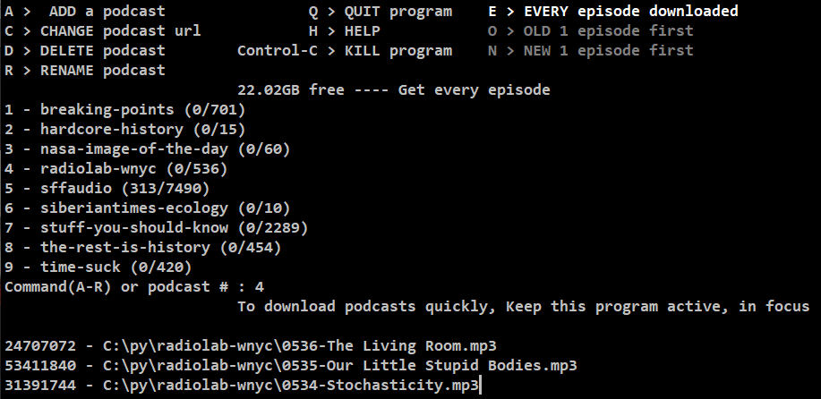

# Python Console Podcast Downloader

Using Anaconda, with conda 23.7.4 and Python 3.11.5, start with python main.py

## Finding Podcast Feeds
  - Use <a href='https://castos.com/tools/find-podcast-rss-feed/'>castos.com</a> to find urls of feeds

