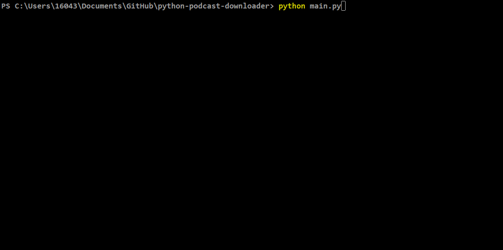

# Python Console Podcast Downloader

## Install
python-3.12.3-amd64.exe from https://www.python.org/downloads/ 

    pip3 install requests
    pip3 install xmltodict
    pip3 install psutil

## Running

    python main.py

## Finding Podcast Feeds
  Use <a href='https://castos.com/tools/find-podcast-rss-feed/'>castos.com</a> to find urls of podcast feeds.

